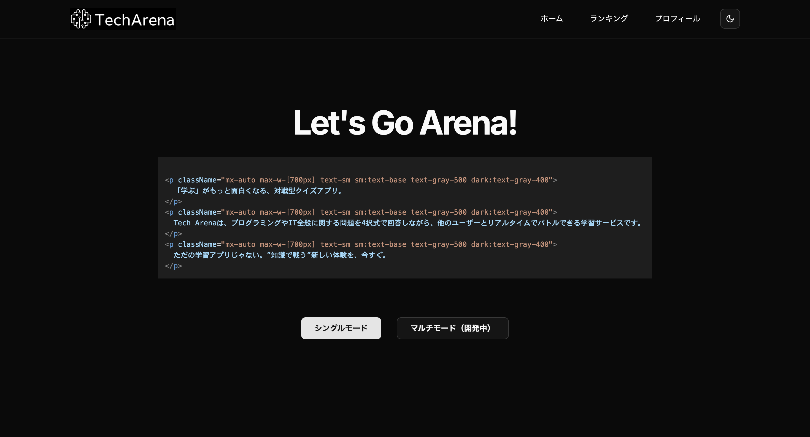

# Tech Arena - クイズバトルアプリ

Tech Arenaは、プログラミングやITに関する知識を活かして、リアルタイムに他のユーザーとバトルできる対戦型クイズアプリです。

 

## 🚀 特徴

- リアルタイム対戦型クイズモード（現在シングルプレイ対応、マルチプレイは開発中）
- ダーク／ライトテーマ対応
- コードハイライト表示（React / JSX）
- `next-themes`によるテーマ切り替え対応
- Tailwind CSS によるレスポンシブな美しいUI

## 🔧 使用技術

- [Next.js 15+](https://nextjs.org/)
- [TypeScript](https://www.typescriptlang.org/)
- [Tailwind CSS](https://tailwindcss.com/)
- [react-syntax-highlighter](https://github.com/react-syntax-highlighter/react-syntax-highlighter)
- [next-themes](https://github.com/pacocoursey/next-themes)

## ▶️ 開発環境での起動方法

```bash
# 依存関係のインストール
npm install

# 開発サーバーの起動
npm run dev

# http://localhost:3000 にアクセス
```

## 🌗 テーマについて
next-themes を使用しており、システムのダーク／ライトモードに自動で追従します。

コードハイライトは、テーマに応じて vscDarkPlus または oneLight が適用されます。

## ✨ 今後の展望
マルチプレイヤーモードの実装

問題カテゴリの追加（JavaScript, Python, インフラ など）

フレンド機能

問題投稿機能